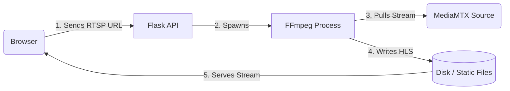

# RTSP Livestream Overlay Web Application

## 1. Project Overview

The **RTSP Livestream Overlay Web Application** is a system that allows users to play RTSP livestreams directly in a web browser and manage real-time overlays (text and images) on top of the video feed.

This project solves a common constraint in web development: browsers do not natively support the RTSP protocol used by most IP cameras. This application bridges this gap by converting the stream and providing a drag-and-drop interface for dynamic overlay management.

**Key Features:**
*   **RTSP Playback:** Converts RTSP streams to HLS for persistent browser playback.
*   **Dynamic Overlays:** Add, move, cancel, and resize text/image overlays in real-time.
*   **Persistence:** Overlay positions and configurations are saved to a database and restored upon page reload.
*   **Single-User Focused:** Designed for local execution and demonstration.

---

## 2. Technology Stack

### Backend
*   **Language:** Python 3.12+
*   **Framework:** Flask (chosen for its simplicity and modular blueprint system).
*   **Dependencies:** `flask-limiter` (rate limiting), `bleach` (sanitization), `mongoengine` (ODM).

### Frontend
*   **Framework:** React 18+
*   **Routing:** React Router v7.
*   **Build Tool:** Vite.
*   **Functionality:** Custom drag-and-drop logic, HLS video player integration.

### Database
*   **System:** MongoDB (Atlas or Local).
*   **Role:** Persists overlay configurations (coordinates, content, dimensions).

### Streaming Pipeline
*   **FFmpeg:** Handles the core transcoding of raw RTSP streams into HLS playlists (.m3u8) and segments (.ts).
*   **MediaMTX:** Acts as a lightweight, zero-dependency RTSP server to simulate a live camera feed during development.
*   **Protocol:** HLS (HTTP Live Streaming) is used for delivery to the browser.

---

## 3. Software Development Process

This project was developed using the **Waterfall Software Development Lifecycle (SDLC)** model.

**Why Waterfall?**
Given the fixed scope, strict deadline (24 hours), and well-defined requirements of this assignment, a sequential approach was more efficient than an iterative Agile cycle. It allowed for a "design once, build right" strategy.

### Phases:
1.  **Requirement Analysis:** Analyzed the prompt to define functional (RTSP playback, overlays) and non-functional (latency, browser compatibility) requirements.
2.  **Planning & System Design:** Designed the modular monolith architecture, including the decision to use HLS for stream compatibility and a separate overlay layer.
3.  **Implementation:** Features were built sequentially—Database models -> Backend APIs -> RTSP Pipeline -> Frontend UI.
4.  **Testing & Quality Assurance:** Focus was placed on backend correctness (Unit/Integration tests) to ensure reliable API logic.
5.  **Documentation:** Final generation of this guide and code comments.

---

## 4. System Architecture

The system follows a **Three-Tier Architecture**:

1.  **Presentation Tier (Client):**
    *   React application running in the browser.
    *   Renders the HLS stream using a `<video>` element (via hls.js).
    *   Renders an absolute-positioned "Overlay Layer" on top of the video.

2.  **Logic Tier (Application Server):**
    *   **Flask API:** Handles business logic for overlay CRUD and stream lifecycle.
    *   **FFmpeg Wrapper:** A sub-process manager that converts the input RTSP stream into static HLS files served by Flask.

3.  **Data Tier:**
    *   **MongoDB:** Stores persistent overlay data.
    *   **RTSP Server (MediaMTX):** The external source of the video stream.

**Architecture Flow:**



---

## 5. RTSP Streaming Pipeline

**The Problem:** Browsers (Chrome, Firefox, Safari) cannot natively play `rtsp://` streams. They only understand HTTP-based protocols like HLS (HTTP Live Streaming) or DASH.

**The Solution:**
1.  **Source Simulation:** We use **MediaMTX** to host a local RTSP server. We push a standard video file to it using `ffmpeg` to simulate a "live camera".
2.  **Ingestion:** The User provides the RTSP URL to the Flask app.
3.  **Transcoding:** Flask spawns a background `ffmpeg` process. This process consumes the RTSP stream and chunks it into small `.ts` (MPEG-TS) files and a `.m3u8` manifest.
4.  **Delivery:** The Flask app serves these static files from its `static/hls` directory.
5.  **Playback:** The React frontend polls the `.m3u8` file and plays the resulting video, creating a near-live experience.

---

## 6. Overlay System Design

Overlays are independent of the video stream itself; they are not "burned in" to the video but rendered on top of it using CSS.

*   **Types:** `Text` (supports basic HTML sanitization) and `Image` (URL-based).
*   **Properties:** `x`, `y` (coordinates), `width`, `height`, `zIndex`, `visible`.
*   **Interaction:**
    *   **Drag & Drop:** Users can click and drag to move overlays.
    *   **Resizing:** Users can drag corners to resize.
*   **Performance:**
    *   Updates during dragging are **debounced** (delayed) on the client side. This prevents thousands of API calls from firing while a user drags an object across the screen. The save happens only when movement stops.
*   **Persistence:** All changes are saved to MongoDB immediately. Reloading the page fetches the latest state, ensuring the layout remains consistent.

---

## 7. Backend API Documentation

Base URL: `http://localhost:5000/api`

### Overlay Management

| Method | Endpoint | Description | Request Body Example | Response Example |
| :--- | :--- | :--- | :--- | :--- |
| **GET** | `/overlays` | Get all overlays | N/A | `[{"_id": "...", "type": "text", ...}]` |
| **POST** | `/overlays` | Create new overlay | `{"type": "text", "content": "Hello", "x": 10, "y": 10}` | `{"_id": "...", "type": "text", ...}` |
| **PUT** | `/overlays/<id>` | Update overlay | `{"x": 50, "y": 100}` | `{"_id": "...", "x": 50, "y": 100, ...}` |
| **DELETE** | `/overlays/<id>` | Delete overlay | N/A | `{"message": "Overlay deleted"}` |

### RTSP Control

| Method | Endpoint | Description | Request Body Example | Response Example |
| :--- | :--- | :--- | :--- | :--- |
| **POST** | `/rtsp/connect` | Start stream conversion | `{"url": "rtsp://localhost..."}` | `{"status": "live", "streamUrl": "..."}` |

---

## 8. Database Design

**Collection:** `overlays`

**Schema (Overlay):**
```json
{
  "_id": "ObjectId",
  "type": "String ('text' or 'image')",
  "content": "String (Text body or Image URL)",
  "x": "Number (Position X)",
  "y": "Number (Position Y)",
  "width": "Number",
  "height": "Number",
  "zIndex": "Number",
  "visible": "Boolean",
  "created_at": "ISODate",
  "updated_at": "ISODate"
}
```

RTSP stream data is ephemeral and not stored in the database.

---

## 9. Testing & Quality Assurance

Testing was focused heavily on the **Backend** to ensure robust API logic and data integrity.

*   **Unit Tests:** Validate individual service methods (e.g., ensuring validators catch invalid URLs, ensuring sanitizers strip XSS scripts).
*   **Integration Tests:** Test the API endpoints interacting with a mocked database.
*   **End-to-End (Backend):** Test the full flow from API call -> Service -> Validator -> DB Response.

**Tools Used:** `pytest`, `mongomock`.
**Future Scope:** Frontend tests using `Vitest` and `Testing Library` would be the next step for production readiness.

---

## 10. AI-Assisted Development Workflow

This project utilized AI agents (powered by **Claude Sonnet 4.5** and **Claude Opus 4.5**) to accelerate development while maintaining strict architectural standards.

*   **Workflow:**
    1.  **Analysis:** AI helped break down the prompt into a technical specification.
    2.  **Scaffolding:** Agents generated the initial folder structure and boilerplate configurations.
    3.  **Refactoring:** AI assisted in separating logic into the `modules/` and `infrastructure/` directories.
    4.  **Testing:** AI generated comprehensive test cases for the backend.
*   **Oversight:** A strict set of constraints (`.github/project-general.instructions.md`) was provided to the agents to ensure they followed the Waterfall model and Modular Monolith pattern, rather than hallucinating unnecessary microservices or complex features.

---

## 11. How to Run the Project Locally

### Prerequisites
*   Python 3.12+
*   Node.js & pnpm
*   FFmpeg (installed and in system PATH)
*   MongoDB (running locally or a connection string)

### Step 1: Services Setup (RTSP Mock)
1.  Download **MediaMTX** (binary) for your OS.
2.  Run the MediaMTX executable in a terminal:
    ```bash
    ./mediamtx
    ```
3.  Stream a local video file to it (simulating a camera):
    ```bash
    ffmpeg -re -stream_loop -1 -i "C:/path/to/video.mp4" -c copy -f rtsp rtsp://localhost:8554/test
    ```
    *(Replace `C:/path/to/video.mp4` with an actual video file on your disk)*

### Step 2: Backend Setup
1.  Navigate to `apps/server`:
    ```bash
    cd apps/server
    ```
2.  Create virtual environment and install dependencies:
    ```bash
    python -m venv venv
    source venv/bin/activate  # or venv\Scripts\activate
    pip install -r requirements.txt
    ```
3.  Run the server:
    ```bash
    python -m src.app
    ```
    *Server runs on `http://localhost:5000`*

### Step 3: Frontend Setup
1.  Navigate to `apps/web`:
    ```bash
    cd apps/web
    ```
2.  Install dependencies:
    ```bash
    pnpm install
    ```
3.  Start the development server:
    ```bash
    pnpm dev
    ```
    *Web app runs on `http://localhost:5173`*

### Step 4: Usage
1.  Open the web app.
2.  Enter `rtsp://localhost:8554/test` (or your generic RTSP URL) in the input box.
3.  Click **Play**. Wait a few seconds for HLS conversion to start.
4.  Use the "Add Overlay" button to create widgets on the video.

---

## 12. Demo Video Instructions

The accompanying demo video illustrates:
1.  **Startup:** Starting the backend and frontend servers.
2.  **Playback:** Entering the RTSP URL and seeing the video load.
3.  **Interaction:** Creating a text overlay, changing its text, resizing an image overlay, and dragging them around the player.
4.  **Persistence:** Hitting "Refresh" on the browser and seeing the overlays reappear exactly where they were left.

---

## 13. Limitations & Future Improvements

*   **Latency:** HLS introduces a 5-10 second delay. Using **WebRTC** for the conversion pipeline would provide sub-second latency.
*   **Authentication:** Currently, there is no user login. Everyone shares the same view.
*   **Concurrency:** The backend handles one stream at a time efficiently. Multi-stream support would require dynamic process management.
